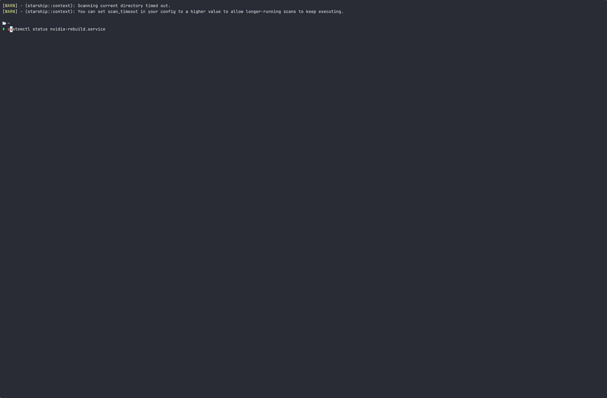

# NVIDIA `.run` auto-rebuild no boot (Arch + Wayland)


Automatiza a reinstalação do driver proprietário da NVIDIA via `.run` no boot do Arch Linux, **antes** do ambiente gráfico iniciar — solução necessária para quem usa Wayland e não pode executar o instalador com o servidor gráfico ativo.

---

## 📦 O que isso faz

Quando `linux-lts` ou `linux-lts-headers` atualizam:

1. O hook do pacman marca que a NVIDIA precisa ser recompilada
2. No próximo boot, ainda no estágio inicial do systemd (`sysinit.target`)
3. O script roda **antes de qualquer coisa de vídeo existir**
4. O driver é recompilado via `.run --dkms`
5. O `mkinitcpio -P` é executado
6. O GNOME/Wayland sobe já com o módulo correto

Sem TTY. Sem tela preta. Sem reinstalar manualmente.

---

## ⚙️ Instalação (recomendado)

A partir da raiz deste repositório:

```bash
chmod +x init.sh
sudo ./init.sh install
```

O `init.sh` é o **instalador oficial do projeto** e faz automaticamente:

* copia `etc/` → `/etc`
* copia `usr/` → `/usr`
* baixa o `.run` oficial da NVIDIA para `/opt`
* ajusta automaticamente o caminho do `.run` dentro de `/usr/local/bin/nvidia-rebuild.sh`
* recarrega o systemd
* habilita o serviço

---

## 🔎 Verificar status

````bash
./init.sh status
```bash
./nvidia-auto-rebuild.sh status
````

---

## ♻️ Reinstalar

````bash
sudo ./init.sh install
```bash
sudo ./nvidia-auto-rebuild.sh reinstall
````

---

## ❌ Remover tudo

````bash
sudo ./init.sh uninstall
```bash
sudo ./nvidia-auto-rebuild.sh uninstall
````

---

## 🧪 Teste rápido (sem atualizar kernel)

Simule o que o hook faria:

```bash
sudo touch /var/lib/nvidia-reinstall-required
sudo reboot
```

Após entrar no sistema:

```bash
cat /var/log/nvidia-rebuild.log
```

---

## 🧠 Por que isso é necessário?

O instalador `.run` da NVIDIA **não pode ser executado com Wayland/Xorg ativos**.
Hooks do pacman rodam com o sistema gráfico em execução, portanto falham.

A única forma estável é recompilar o driver **no boot, antes do gráfico**.

---

## 📝 Requisitos

* Arch Linux
* Kernel `linux-lts`
* `linux-lts-headers`
* Driver NVIDIA instalado via `.run` com suporte a `--dkms`
* Caminho do `.run` ajustado em:

```
/usr/local/bin/nvidia-rebuild.sh
```

---

## ⬇️ Download automático do `.run`

O `init.sh` baixa automaticamente o instalador oficial da NVIDIA durante a instalação.

Configuração usada no script:

```bash
BASE_DIR="/opt"
URL="https://download.nvidia.com/XFree86/Linux-x86_64/"
VERSION="NVIDIA-Linux-x86_64-580.126.18.run"
```

O arquivo é preparado em:

```
/opt/NVIDIA-Linux-x86_64-580.126.18/
```

E o caminho é injetado automaticamente dentro de:

```
/usr/local/bin/nvidia-rebuild.sh
```

Para atualizar a versão do driver no futuro, altere apenas a variável `VERSION` no `init.sh` e rode novamente:

```bash
sudo ./init.sh install
```

---

## 🧰 Instalação manual (modo antigo)

<details>
<summary>Clique para expandir</summary>

A partir da raiz do repositório:

```bash
sudo cp -r etc/ /
sudo cp -r usr/ /

sudo systemctl daemon-reload
sudo systemctl enable nvidia-rebuild.service
```

Verifique:

```bash
ls /etc/pacman.d/hooks/nvidia-rebuild.hook
ls /etc/systemd/system/nvidia-rebuild.service
ls /usr/local/bin/nvidia-rebuild.sh
```

</details>

---

## ✨ Features

* Rebuild automático do driver NVIDIA **antes** do Wayland iniciar
* Integração limpa com `pacman hook`
* Integração com `systemd` no estágio `sysinit`
* Instalação e remoção via script único
* Totalmente transparente ao usuário após configurado

---

## 🧭 Como funciona (fluxo interno)

```text
pacman atualiza kernel
        ↓
hook marca /var/lib/nvidia-reinstall-required
        ↓
reboot
        ↓
systemd (sysinit.target)
        ↓
nvidia-rebuild.service
        ↓
nvidia-rebuild.sh
        ↓
.run --dkms recompila o módulo
        ↓
mkinitcpio -P
        ↓
Wayland inicia já com o driver correto
```

---

## 🗂️ Estrutura do repositório

````text
etc/
 ├─ pacman.d/hooks/nvidia-rebuild.hook
 └─ systemd/system/nvidia-rebuild.service

usr/
 └─ local/bin/nvidia-rebuild.sh   ← script que faz o rebuild real no boot

init.sh                          ← instalador/desinstalador do projeto
README.md
LICENSE
````

---

## 🩺 Troubleshooting

### O serviço não executou no boot

Verifique o status:

```bash
systemctl status nvidia-rebuild.service
journalctl -u nvidia-rebuild.service -b
```

### O log mostra erro de compilação DKMS

Confirme que os headers estão instalados:

```bash
pacman -Qs linux-lts-headers
```

### O `.run` não foi encontrado

Edite o caminho dentro de:

```
/usr/local/bin/nvidia-rebuild.sh
```

E confirme que o arquivo existe e é executável.

### Wayland não sobe após atualização

Confira o log gerado:

```bash
cat /var/log/nvidia-rebuild.log
```

Quase sempre o problema é caminho incorreto do `.run` ou headers ausentes.

---

<!--
## 🎥 Demonstração do boot automático

 [](.github/boot.mp4) -->

<!-- Você pode gravar um GIF do processo para mostrar o serviço rodando antes do gráfico.

Sugestão usando tty e `asciinema`:

```bash
asciinema rec boot.cast
```

Depois converta para GIF e adicione aqui:

```markdown

```

Isso ajuda muito quem visita o repositório a entender o funcionamento visualmente. -->
